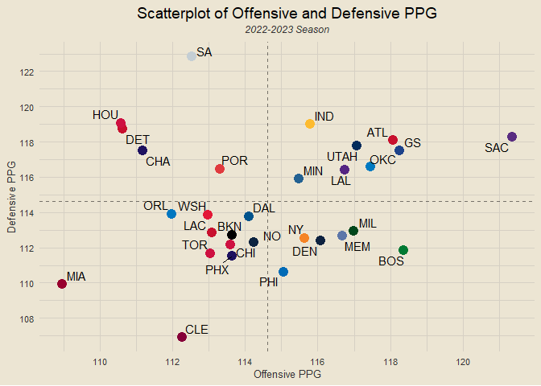

NBA EDA
================
Chad Allison
2023-07-11

### Loading Libraries

``` r
library(tidyverse)
library(janitor)
library(tvthemes)
library(hoopR)

theme_custom = theme_avatar() +
  theme(plot.title = element_text(hjust = 0.5),
        plot.subtitle = element_text(hjust = 0.5, size = 9, vjust = 2.5, face = "italic"),
        plot.caption = element_text(face = "italic"),
        panel.grid.major = element_line(linewidth = 0.5, colour = "#D6D0C4"),
        panel.grid.minor = element_line(linewidth = 0.5, colour = "#D6D0C4"))

theme_set(theme_custom)
```

### Data Import

``` r
# doing this to suppress warning message for every usage
write_csv(load_nba_pbp(), "full_pbp.csv")
full_pbp = read_csv("full_pbp.csv", col_types = cols()) |>
  filter(home_team_abbrev != "LEB") # excludes all star game
```

### Adding Team Color Codes

``` r
team_color_codes = c("#C8102E", "#000000", "#007A33", "#1D1160", "#CE1141", "#860038",
                     "#00538C", "#0E2240", "#C8102E", "#1D428A", "#CE1141", "#FDBB30",
                     "#C8102E", "#552583", "#5D76A9", "#98002E", "#00471B", "#236192",
                     "#0C2340", "#F58426", "#007AC1", "#0077C0", "#006BB6", "#1D1160",
                     "#E03A3E", "#C4CED4", "#5A2D81", "#CE1141", "#002B5C", "#E31837")

team_color_df = data.frame(team = sort(unique(full_pbp$home_team_abbrev)),
                           hex = team_color_codes)
```

### Getting End Game Data

``` r
end_games = full_pbp |>
  filter(text == "End of Game") |>
  select(game_id, date = game_date, away_team = away_team_abbrev,
         away_score, home_score, home_team = home_team_abbrev) |>
  mutate(win_team = ifelse(home_score > away_score, home_team, away_team),
         lose_team = ifelse(home_score > away_score, away_team, home_team))

end_games
```

    ## # A tibble: 1,173 × 8
    ##      game_id date       away_team away_score home_score home_t…¹ win_t…² lose_…³
    ##        <dbl> <date>     <chr>          <dbl>      <dbl> <chr>    <chr>   <chr>  
    ##  1 401469330 2023-04-02 GS               110        112 DEN      DEN     GS     
    ##  2 401469328 2023-04-02 IND              105        115 CLE      CLE     IND    
    ##  3 401469329 2023-04-02 PHI              104        117 MIL      MIL     PHI    
    ##  4 401469326 2023-04-02 LAL              134        109 HOU      LAL     HOU    
    ##  5 401469327 2023-04-02 PHX              128        118 OKC      PHX     OKC    
    ##  6 401469322 2023-04-02 DAL              130        132 ATL      ATL     DAL    
    ##  7 401469323 2023-04-02 WSH              109        118 NY       NY      WSH    
    ##  8 401469324 2023-04-02 DET              102        128 ORL      ORL     DET    
    ##  9 401469325 2023-04-02 SA               142        134 SAC      SA      SAC    
    ## 10 401469319 2023-04-02 UTAH             110        111 BKN      BKN     UTAH   
    ## # … with 1,163 more rows, and abbreviated variable names ¹​home_team, ²​win_team,
    ## #   ³​lose_team

### Getting Team Records

``` r
team_records = end_games |>
  count(win_team) |>
  rename(team = win_team, wins = n) |>
  left_join(end_games |>
  count(lose_team) |>
  rename(team = lose_team, losses = n), by = "team") |>
  mutate(pct = round(wins / (wins + losses), 3),
         record = paste0(wins, "-", losses))

team_records |>
  arrange(desc(pct))
```

    ## # A tibble: 30 × 5
    ##    team   wins losses   pct record
    ##    <chr> <int>  <int> <dbl> <chr> 
    ##  1 MIL      56     22 0.718 56-22 
    ##  2 BOS      54     24 0.692 54-24 
    ##  3 DEN      52     26 0.667 52-26 
    ##  4 PHI      51     27 0.654 51-27 
    ##  5 MEM      49     29 0.628 49-29 
    ##  6 CLE      48     30 0.615 48-30 
    ##  7 SAC      47     31 0.603 47-31 
    ##  8 NY       46     33 0.582 46-33 
    ##  9 BKN      43     35 0.551 43-35 
    ## 10 PHX      43     35 0.551 43-35 
    ## # … with 20 more rows

### First to 69

``` r
get_first_to_69 = function(gid) {
  return(full_pbp |>
    filter(game_id == gid) |>
    mutate(sequence_number = as.integer(sequence_number)) |>
    arrange(sequence_number) |>
    filter(home_score >= 69 | away_score >= 69) |>
    head(1) |>
    transmute(first_to_69 = ifelse(home_score >= 69, home_team_abbrev, away_team_abbrev)) |>
    pull(first_to_69))
}

first_to_69_df = end_games |>
  sample_n(10) |>
  mutate(ft69 = sapply(game_id, get_first_to_69))

first_to_69_df |>
  mutate(ft69_win = ifelse(ft69 == win_team, 1, 0)) |>
  summarise(pct = round(sum(ft69_win) / n(), 3))
```

    ## # A tibble: 1 × 1
    ##     pct
    ##   <dbl>
    ## 1   0.8

### Getting Offensive and Defensive PPG Data (Regular Season)

``` r
get_off_ppg = function(team) {
  home_scores = end_games |> filter(home_team == team) |> pull(home_score)
  away_scores = end_games |> filter(away_team == team) |> pull(away_score)
  return(round(mean(c(home_scores, away_scores)), 3))
}

get_def_ppg = function(team) {
  home_scores = end_games |> filter(home_team == team) |> pull(away_score)
  away_scores = end_games |> filter(away_team == team) |> pull(home_score)
  return(round(mean(c(home_scores, away_scores)), 3))
}

team_ppg = data.frame(team = team_records$team) |>
  mutate(off_ppg = sapply(team, get_off_ppg),
         def_ppg = sapply(team, get_def_ppg))

team_ppg |>
  ggplot(aes(off_ppg, def_ppg)) +
  geom_point(aes(col = team), size = 4, show.legend = F) +
  ggrepel::geom_text_repel(aes(label = team), size = 4) +
  geom_vline(aes(xintercept = mean(off_ppg)), linetype = "dashed", alpha = 0.5) +
  geom_hline(aes(yintercept = mean(def_ppg)), linetype = "dashed", alpha = 0.5) +
  scale_color_manual(values = team_color_codes) +
  labs(x = "Offensive PPG", y = "Defensive PPG",
       title = "Scatterplot of Offensive and Defensive PPG", subtitle = "2022-2023 Season") +
  scale_x_continuous(breaks = seq(100, 130, by = 2)) +
  scale_y_continuous(breaks = seq(100, 130, by = 2))
```

<!-- -->

### Reframing End Game Data

``` r
reframed_end_games = end_games |>
  group_by(game_id, date, team = home_team) |>
  reframe(opponent = away_team,
            team_score = home_score,
            opp_score = away_score) |>
  mutate(home_away = "home") |>
  rbind(end_games |>
  group_by(game_id, date, team = away_team) |>
  reframe(opponent = home_team,
          team_score = away_score,
          opp_score = home_score) |>
  mutate(home_away = "away"))

reframed_end_games
```

    ## # A tibble: 2,346 × 7
    ##      game_id date       team  opponent team_score opp_score home_away
    ##        <dbl> <date>     <chr> <chr>         <dbl>     <dbl> <chr>    
    ##  1 401468016 2022-10-18 BOS   PHI             126       117 home     
    ##  2 401468017 2022-10-18 GS    LAL             123       109 home     
    ##  3 401468018 2022-10-19 DET   ORL             113       109 home     
    ##  4 401468019 2022-10-19 IND   WSH             107       114 home     
    ##  5 401468020 2022-10-19 ATL   HOU             117       107 home     
    ##  6 401468021 2022-10-19 BKN   NO              108       130 home     
    ##  7 401468022 2022-10-19 MIA   CHI             108       116 home     
    ##  8 401468023 2022-10-19 TOR   CLE             108       105 home     
    ##  9 401468024 2022-10-19 MEM   NY              115       112 home     
    ## 10 401468025 2022-10-19 MIN   OKC             115       108 home     
    ## # … with 2,336 more rows

### xxx - third qtr leads

``` r
end_games |>
  select(game_id, win_team, lose_team) |>
  inner_join(full_pbp |>
  filter(text == "End of the 3rd Quarter") |>
  transmute(game_id, win_3q = case_when(home_score > away_score ~ home_team_abbrev,
                                        home_score < away_score ~ away_team_abbrev,
                                        home_score == away_score ~ "Tied")), by = "game_id")
```

    ## # A tibble: 1,173 × 4
    ##      game_id win_team lose_team win_3q
    ##        <dbl> <chr>    <chr>     <chr> 
    ##  1 401469330 DEN      GS        DEN   
    ##  2 401469328 CLE      IND       IND   
    ##  3 401469329 MIL      PHI       MIL   
    ##  4 401469326 LAL      HOU       LAL   
    ##  5 401469327 PHX      OKC       PHX   
    ##  6 401469322 ATL      DAL       ATL   
    ##  7 401469323 NY       WSH       NY    
    ##  8 401469324 ORL      DET       ORL   
    ##  9 401469325 SA       SAC       SA    
    ## 10 401469319 BKN      UTAH      BKN   
    ## # … with 1,163 more rows

### Scorigami

``` r
end_games |>
  transmute(date, home_team, away_team,
            win_score = ifelse(home_score > away_score, home_score, away_score),
            lose_score = ifelse(home_score > away_score, away_score, home_score)) |>
  count(win_score, lose_score) |>
  filter(between(win_score, 100, 125) & between(lose_score, 100, 125)) |>
  ggplot(aes(win_score, lose_score)) +
  geom_point(size = 3, col = "#C88F3E") +
  geom_abline(alpha = 0.5) +
  scale_x_continuous(breaks = seq(100, 125, by = 1)) +
  scale_y_continuous(breaks = seq(100, 125, by = 1)) +
  labs(x = "Winning Score", y = "Losing Score",
       title = "2022-2023 NBA Scorigami",
       subtitle = "For visualization purposes, only includes scores between 100 and 125",
       caption = "Data: NBA.com via {hoopR}")
```

<!-- -->

### historic final scores + last time a score happened

``` r
get_final_scores = function(yr) {
  return(load_nba_schedule(yr) |>
    filter(home_score != 0 & away_score != 0) |>
    transmute(date = game_date,
              win_score = ifelse(home_score > away_score, home_score, away_score),
              lose_score = ifelse(home_score > away_score, away_score, home_score),
              score = paste0(win_score, "-", lose_score)))
}

for (i in 2010:2023) {
  df = get_final_scores(i)
  if (i == 2010) {
    all_final_scores = df
  } else {
    all_final_scores = rbind(all_final_scores, df)
  }
}

last_time_score_happened = function(fscore) {
  return(all_final_scores |>
    filter(score == fscore) |>
    slice_max(date) |>
    head(1) |> pull(date))
}

last_time_score_happened("112-110")
```

    ## [1] "2023-04-02"

### xxx

``` r
wend_records = end_games |>
  mutate(weekday = wday(date, label = T, abbr = T),
         weekend = ifelse(weekday %in% c("Fri", "Sat", "Sun"), "weekend", "weekday")) |>
  filter(weekend == "weekend") |>
  count(win_team) |>
  rename(team = win_team, weekend_wins = n) |>
  inner_join(end_games |>
  mutate(weekday = wday(date, label = T, abbr = T),
         weekend = ifelse(weekday %in% c("Fri", "Sat", "Sun"), "weekend", "weekday")) |>
  filter(weekend == "weekday") |>
  count(win_team) |>
  rename(team = win_team, weekday_wins = n), by = "team") |>
  inner_join(end_games |>
  mutate(weekday = wday(date, label = T, abbr = T),
         weekend = ifelse(weekday %in% c("Fri", "Sat", "Sun"), "weekend", "weekday")) |>
  filter(weekend == "weekend") |>
  count(lose_team) |>
  rename(team = lose_team, weekend_losses = n), by = "team") |>
  inner_join(end_games |>
  mutate(weekday = wday(date, label = T, abbr = T),
         weekend = ifelse(weekday %in% c("Fri", "Sat", "Sun"), "weekend", "weekday")) |>
  filter(weekend == "weekday") |>
  count(lose_team) |>
  rename(team = lose_team, weekday_losses = n), by = "team") |>
  mutate(weekend_pct = round(weekend_wins / (weekend_wins + weekend_losses), 3),
         weekday_pct = round(weekday_wins / (weekday_wins + weekday_losses), 3))

wend_records |>
  ggplot(aes(weekday_pct, weekend_pct)) +
  geom_point(aes(col = team), size = 4, show.legend = F) +
  geom_line(stat = "smooth", formula = y ~ x, method = "lm", linetype = "dashed", alpha = 0.5) +
  ggrepel::geom_text_repel(aes(label = team), size = 4) +
  annotate("text", x = 0.75, y = 0.25, label = "Better on\nWeekdays", fontface = "italic", alpha = 0.5) +
  annotate("text", x = 0.275, y = 0.75, label = "Better on\nWeekends", fontface = "italic", alpha = 0.5) +
  scale_color_manual(values = team_color_codes) +
  scale_x_continuous(breaks = seq(0, 1, by = 0.1), labels = scales::percent) +
  scale_y_continuous(breaks = seq(0, 1, by = 0.1), labels = scales::percent) +
  labs(x = "Weekday Win Percentage", y = "Weekend Win Percentage",
       title = "Win Percentages on Weekdays v. Weekends",
       subtitle = paste0("Correlation: ", round(cor(wend_records$weekday_pct, wend_records$weekend_pct), 3)),
       caption = "Data: NBA.com via {hoopR}")
```

<!-- -->

``` r
wend_records |>
  transmute(team, weekday_pct, weekend_pct, diff = weekday_pct - weekend_pct, abs_diff = abs(diff)) |>
  arrange(desc(abs_diff))
```

    ## # A tibble: 30 × 5
    ##    team  weekday_pct weekend_pct   diff abs_diff
    ##    <chr>       <dbl>       <dbl>  <dbl>    <dbl>
    ##  1 BKN         0.405       0.722 -0.317    0.317
    ##  2 WSH         0.579       0.3    0.279    0.279
    ##  3 LAL         0.41        0.615 -0.205    0.205
    ##  4 LAC         0.6         0.412  0.188    0.188
    ##  5 MIL         0.795       0.618  0.177    0.177
    ##  6 DET         0.279       0.114  0.165    0.165
    ##  7 OKC         0.409       0.571 -0.162    0.162
    ##  8 UTAH        0.537       0.378  0.159    0.159
    ##  9 GS          0.452       0.595 -0.143    0.143
    ## 10 ATL         0.439       0.568 -0.129    0.129
    ## # … with 20 more rows
